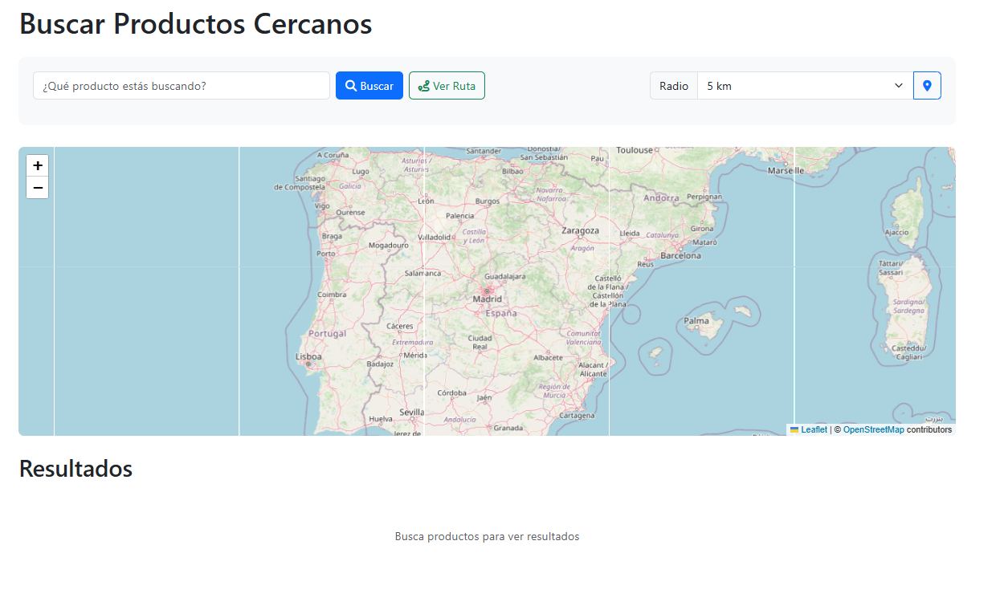
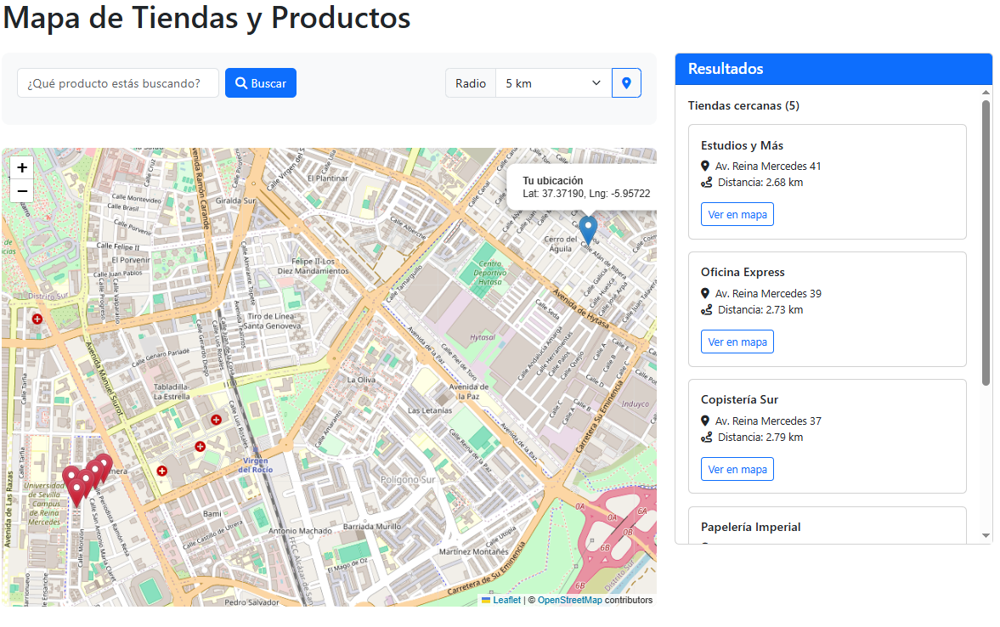
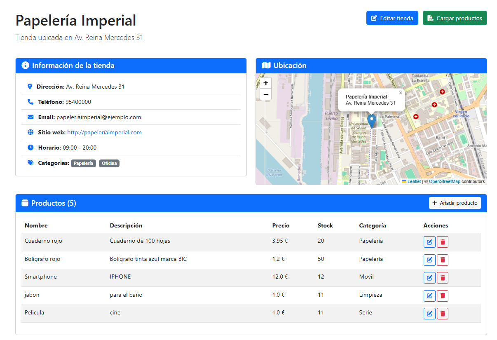

# Memoria - Aplicación TiendasGeo


*   **Autores:** Francisco Capote García y Marcos Padilla Gómez
*   **Tutor:** Maria Teresa Gómez López
*   **Titulación:** Complementos de Bases de Datos
*   **Fecha:** 27-04-2025


# Índice


*   [Capítulo 1: Introducción](#capítulo-1-introducción)
*   [Capítulo 2: Estado del Arte y Tecnologías](#capítulo-2-estado-del-arte-y-tecnologías)
*   [Capítulo 3: Diseño y Arquitectura](#capítulo-3-diseño-y-arquitectura)
*   [Capítulo 4: Manual de Usuario](#capítulo-4-manual-de-usuario)
*   [Capítulo 5: Manual de Despliegue/Instalación](#capítulo-5-manual-de-despliegueinstalación)
*   [Capítulo 6: Conclusiones y Trabajo Futuro](#capítulo-6-conclusiones-y-trabajo-futuro)
*   [Bibliografía](#bibliografía)


# Capítulo 1: Introducción

## 1.1. Estructura de la Memoria

Esta memoria técnica documenta en detalle el proceso de desarrollo, diseño e implementación de la aplicación TiendasGeo. El documento se organiza en los siguientes capítulos para facilitar su comprensión:

*   **Capítulo 1: Introducción:** Presenta la motivación, los objetivos, el alcance del proyecto y la estructura de este documento.
*   **Capítulo 2: Estado del Arte y Tecnologías:** Analiza soluciones similares existentes y justifica la selección de las tecnologías clave utilizadas en el desarrollo (Flask, MongoDB, Leaflet.js, Docker, etc.).
*   **Capítulo 3: Diseño y Arquitectura:** Describe la arquitectura general de la aplicación, el diseño detallado de la base de datos NoSQL, el diseño de la interfaz de usuario y la estructura de las rutas o API.
*   **Capítulo 4: Manual de Usuario:** Proporciona una guía detallada sobre cómo utilizar las diferentes funcionalidades de la aplicación desde la perspectiva del usuario final (consumidor y propietario de tienda).
*   **Capítulo 5: Manual de Despliegue/Instalación:** Ofrece instrucciones paso a paso para instalar y ejecutar la aplicación tanto en un entorno local como utilizando Docker.
*   **Capítulo 6: Conclusiones y Trabajo Futuro:** Resume los logros del proyecto, evalúa la consecución de los objetivos, discute las dificultades encontradas y propone posibles líneas de mejora o expansión futura.

Finalmente, se incluye una sección de **Bibliografía** con las referencias a las fuentes consultadas durante el desarrollo del proyecto y la redacción de esta memoria.

## 1.2. Motivación y Justificación

En el dinámico entorno comercial actual, la capacidad de localizar rápidamente productos específicos en establecimientos cercanos se ha convertido en una necesidad fundamental tanto para consumidores como para comerciantes. Los consumidores buscan optimizar su tiempo y esfuerzo, prefiriendo encontrar lo que necesitan sin tener que desplazarse largas distancias o visitar múltiples tiendas. Por otro lado, los comerciantes, especialmente los pequeños y medianos negocios, necesitan herramientas efectivas para aumentar su visibilidad y atraer clientes locales que buscan activamente sus productos. La falta de una solución centralizada y fácil de usar que conecte la demanda de productos específicos con la oferta local crea una brecha significativa en el mercado.

El proyecto TiendasGeo surge como respuesta directa a esta necesidad. La motivación principal es desarrollar una plataforma web que actúe como un puente entre consumidores y tiendas locales, facilitando la búsqueda de productos y la localización geográfica de los puntos de venta más próximos. La justificación de este proyecto reside en el valor añadido que aporta a ambos lados del espectro comercial. Para los usuarios, representa una herramienta práctica para ahorrar tiempo y encontrar productos de manera eficiente. Para las tiendas, ofrece un canal digital para promocionar su inventario, atraer a clientes potenciales en su área de influencia y competir de manera más efectiva en un mercado cada vez más digitalizado. La implementación de tecnologías geoespaciales es clave en este contexto, ya que permite ofrecer resultados de búsqueda altamente relevantes basados en la proximidad física, mejorando significativamente la experiencia del usuario y la efectividad de la plataforma.

## 1.3. Objetivos del Proyecto

El desarrollo de la aplicación TiendasGeo se guía por un conjunto claro de objetivos, diseñados para abordar la problemática descrita y entregar una solución robusta y funcional.

**Objetivo General:**

Desarrollar e implementar una aplicación web integral que permita a los usuarios buscar productos específicos y localizar las tiendas más cercanas que los ofrecen, utilizando para ello tecnologías geoespaciales y proporcionando a los comerciantes herramientas para gestionar su información e inventario.

**Objetivos Específicos:**

Para alcanzar el objetivo general, se definieron los siguientes objetivos específicos:

*   **Implementar un sistema de búsqueda geoespacial:** Desarrollar la funcionalidad central que permita a los usuarios buscar tiendas basándose en su ubicación actual o una dirección específica, ordenando los resultados por proximidad.
*   **Desarrollar la gestión de tiendas y productos:** Crear módulos completos que permitan a los propietarios de tiendas registrar sus establecimientos, incluyendo detalles como nombre, dirección, contacto, horario y, fundamentalmente, su ubicación geográfica precisa. Asimismo, permitir la gestión (crear, leer, actualizar, eliminar - CRUD) de los productos asociados a cada tienda.
*   **Facilitar la carga masiva de inventario:** Implementar una funcionalidad que permita a los dueños de tiendas cargar o actualizar su inventario de productos de forma eficiente mediante la subida de archivos en formato CSV (Comma-Separated Values), reduciendo el esfuerzo manual.
*   **Visualizar tiendas en un mapa interactivo:** Integrar una solución de mapas dinámicos (como Leaflet.js) que permita a los usuarios visualizar la ubicación de las tiendas en un mapa, interactuar con marcadores para obtener información adicional y visualizar su propia ubicación en relación con las tiendas.
*   **Implementar un sistema de autenticación de usuarios:** Desarrollar un sistema seguro para el registro e inicio de sesión de usuarios (tanto consumidores como propietarios de tiendas), asegurando que solo los usuarios autorizados puedan gestionar la información de las tiendas y productos.
*   **Contenerizar la aplicación:** Utilizar Docker y Docker Compose para empaquetar la aplicación y sus dependencias (incluida la base de datos MongoDB), facilitando así su configuración, despliegue y escalabilidad en diferentes entornos.

## 1.4. Alcance del Proyecto

El alcance de TiendasGeo se centra en proporcionar las funcionalidades esenciales para cumplir con los objetivos planteados. La aplicación está diseñada para dos tipos principales de usuarios: los **consumidores**, que buscan productos y tiendas, y los **propietarios de tiendas**, que gestionan la información de sus establecimientos y su inventario.

**Funcionalidades Incluidas:**

*   Registro e inicio de sesión para propietarios de tiendas.
*   Creación y edición de tiendas, incluyendo la geolocalización precisa mediante un mapa interactivo.
*   Creación, edición y eliminación de productos asociados a una tienda, incluyendo detalles como nombre, descripción, precio y stock.
*   Carga de inventario de productos mediante archivos CSV.
*   Búsqueda de productos por nombre.
*   Búsqueda de tiendas cercanas a la ubicación del usuario (requiere permiso de geolocalización).
*   Visualización de las tiendas encontradas en una lista ordenada por distancia y en un mapa interactivo con marcadores.
*   Visualización de los detalles de una tienda específica y los productos que ofrece.

**Funcionalidades Excluidas (Potenciales Mejoras Futuras):**

*   Sistema de valoraciones o reseñas de tiendas y productos.
*   Funcionalidades avanzadas de filtrado de búsqueda (por categoría, rango de precios, etc.).
*   Aplicaciones móviles nativas para iOS o Android.
*   Panel de administración avanzado para la gestión global de la plataforma.
* Recomendaciones a los comerciantes sobre que productos son mas buscados localmente.


# Capítulo 2: Estado del Arte y Tecnologías

## 2.1. Aplicaciones Similares

El concepto de localizar establecimientos comerciales o servicios cercanos a la ubicación del usuario no es nuevo. Existen numerosas plataformas y aplicaciones que abordan esta necesidad desde diferentes perspectivas. Un análisis del estado del arte nos permite comprender el panorama existente y posicionar adecuadamente la propuesta de valor de TiendasGeo.

Plataformas como **Google Maps** o **Apple Maps** son herramientas de navegación omnipresentes que incluyen funcionalidades extensivas de búsqueda de negocios. Permiten a los usuarios buscar tipos de establecimientos (restaurantes, tiendas de ropa, farmacias, etc.) en un área geográfica determinada, mostrando su ubicación, horarios, información de contacto y reseñas de otros usuarios. Si bien son extremadamente potentes para la localización general de negocios, su enfoque no está específicamente centrado en la búsqueda de *productos* concretos dentro de esas tiendas. Un usuario puede encontrar una ferretería cercana, pero no sabrá con certeza si esa ferretería dispone del tornillo específico que necesita sin contactar directamente o visitar el lugar.

Existen también **directorios de negocios locales** como Yelp o Foursquare, que se enfocan más en las reseñas y recomendaciones, pero comparten la limitación de Google Maps respecto a la disponibilidad de productos específicos en tiempo real. Algunos grandes minoristas (como cadenas de supermercados o tiendas de electrónica) han desarrollado sus propias **aplicaciones móviles o sitios web** que sí permiten consultar el stock de productos por tienda. Sin embargo, estas soluciones están limitadas al inventario de una única cadena comercial, obligando al usuario a consultar múltiples aplicaciones si busca un producto que podría estar disponible en diferentes tipos de tiendas.

En el ámbito específico de la búsqueda de productos locales, han surgido algunas iniciativas, pero a menudo se centran en nichos particulares (por ejemplo, aplicaciones para encontrar libros en librerías locales) o dependen de la integración manual y costosa con los sistemas de inventario de las tiendas. La dificultad de mantener actualizada la información del stock en tiempo real para una amplia variedad de negocios, especialmente pequeños comercios sin sistemas de gestión avanzados, ha sido un obstáculo importante.

**Diferenciadores de TiendasGeo:**

TiendasGeo busca diferenciarse al ofrecer una plataforma unificada que se centra específicamente en la **búsqueda de productos concretos** y la **localización de la tienda más cercana** que los ofrece. Si bien no pretende (en su alcance actual) una integración en tiempo real con sistemas de inventario complejos, facilita a los propietarios de tiendas, incluidos los pequeños negocios, una forma sencilla de **gestionar y publicar su inventario** mediante una interfaz web intuitiva y la carga de archivos CSV. La combinación de búsqueda de productos, localización geoespacial precisa y herramientas accesibles para los comerciantes constituye su principal propuesta de valor. El uso de MongoDB con capacidades geoespaciales permite una implementación eficiente de la funcionalidad de búsqueda por proximidad, que es central para la experiencia del usuario.

## 2.2. Tecnologías Seleccionadas

La elección de las tecnologías para el desarrollo de TiendasGeo se basó en criterios como la adecuación a los requisitos funcionales, la eficiencia, la escalabilidad, la facilidad de desarrollo y la disponibilidad de una comunidad activa y buena documentación. A continuación, se justifican las elecciones principales:

### 2.2.1. Backend: Python y Flask

*   **Python:** Se seleccionó Python como lenguaje principal para el backend debido a su sintaxis clara, amplia adopción, vasta colección de librerías y fuerte comunidad de soporte. Es un lenguaje versátil, adecuado tanto para el desarrollo web como para tareas de procesamiento de datos (como la manipulación de archivos CSV). El uso frecuente de este lenguaje por parte de los desarrolladores fue determinante.
*   **Flask:** Dentro del ecosistema Python, se optó por Flask como microframework web. A diferencia de frameworks más monolíticos como Django, Flask ofrece mayor flexibilidad y un núcleo minimalista, permitiendo construir la aplicación añadiendo solo las extensiones necesarias. Esto resulta ideal para un proyecto como TiendasGeo, donde se requiere control sobre los componentes específicos a integrar (como PyMongo para la base de datos o Flask-Login para la autenticación). Su simplicidad acelera la curva de aprendizaje y el desarrollo inicial, sin sacrificar la capacidad de construir aplicaciones complejas y escalables.

### 2.2.2. Base de Datos: MongoDB

*   **MongoDB:** La elección de MongoDB como sistema de gestión de base de datos fue estratégica, motivada principalmente por dos factores: su naturaleza NoSQL orientada a documentos y sus potentes capacidades geoespaciales integradas.
    *   **Modelo de Documentos:** Al ser una base de datos NoSQL, MongoDB almacena los datos en documentos flexibles tipo BSON (similar a JSON). Esto se adapta bien a la naturaleza de la información de tiendas y productos, que puede tener estructuras variables o evolucionar con el tiempo, sin requerir migraciones de esquema rígidas como en las bases de datos relacionales.
    *   **Capacidades Geoespaciales:** MongoDB ofrece soporte nativo para datos geoespaciales a través de tipos como GeoJSON (puntos, líneas, polígonos) y operadores de consulta específicos. La capacidad de crear **índices geoespaciales (2dsphere)**  permite realizar consultas de proximidad (`$near`, `$nearSphere`) y búsquedas dentro de áreas geográficas (`$geoWithin`) de manera extremadamente eficiente. Esta funcionalidad es crucial para el requisito central de TiendasGeo: encontrar las tiendas más cercanas a la ubicación del usuario.
*   **PyMongo:** Para interactuar con MongoDB desde la aplicación Flask, se utiliza PyMongo, el driver oficial de MongoDB para Python, que proporciona una interfaz robusta y bien documentada.

### 2.2.3. Frontend: HTML, CSS, JavaScript, Bootstrap

*   **HTML, CSS, JavaScript:** Se utilizaron las tecnologías web estándar para la construcción de la interfaz de usuario. HTML define la estructura del contenido, CSS se encarga de la presentación y el estilo visual, y JavaScript añade interactividad del lado del cliente (por ejemplo, en la validación de formularios o la manipulación del mapa).
*   **Bootstrap:** Se incorporó el framework Bootstrap 5 para agilizar el desarrollo del frontend. Bootstrap proporciona un sistema de rejilla (grid system) responsivo, componentes de interfaz predefinidos (botones, formularios, navegación, etc.) y utilidades CSS que facilitan la creación de una interfaz de usuario atractiva, coherente y adaptable a diferentes tamaños de pantalla (diseño responsivo), desde ordenadores de escritorio hasta dispositivos móviles.

### 2.2.4. Mapas Interactivos: Leaflet.js

*   **Leaflet.js:** Para la visualización de mapas interactivos, se eligió Leaflet.js. Es una biblioteca JavaScript de código abierto, ligera pero potente, especializada en mapas interactivos optimizados para móviles. Permite integrar fácilmente capas de mapas (como OpenStreetMap), añadir marcadores personalizables para representar las tiendas, gestionar eventos del mapa (clics, zoom, movimiento) y obtener la ubicación del usuario. Su API sencilla y su excelente rendimiento la convierten en una opción popular y adecuada para los requisitos de TiendasGeo.

### 2.2.5. Contenerización: Docker y Docker Compose

*   **Docker:** Se utilizó Docker para contenerizar la aplicación. Crear una imagen Docker permite empaquetar la aplicación Flask junto con todas sus dependencias (librerías Python, configuraciones) en un contenedor aislado y portátil. Esto asegura que la aplicación se ejecute de manera consistente en cualquier entorno que soporte Docker (desarrollo, pruebas, producción).
*   **Docker Compose:** Para gestionar la aplicación multi-contenedor (la aplicación Flask y la base de datos MongoDB), se empleó Docker Compose . Mediante un archivo de configuración (`docker-compose.yml`), se define cómo construir y ejecutar ambos servicios, cómo conectarlos en red y cómo gestionar los volúmenes de datos. Esto simplifica enormemente el proceso de configuración y despliegue del entorno completo de la aplicación con un solo comando.

### 2.2.6. Otras Librerías Relevantes

*   **Flask-Login:** Extensión de Flask para gestionar las sesiones de usuario, manejar el inicio y cierre de sesión, y proteger rutas que requieren autenticación.
*   **Python-dotenv:** Utilidad para cargar variables de entorno (como la URI de conexión a MongoDB o claves secretas) desde un archivo `.env`, manteniendo la configuración separada del código fuente.
*   **Pandas:** Aunque no se menciona explícitamente en todos los documentos iniciales, es una librería estándar en Python para la manipulación y análisis de datos, muy probablemente utilizada en el `csv_service.py` para leer y procesar los archivos CSV de inventario de manera eficiente.
*   **Pytest:** Framework utilizado para escribir y ejecutar las pruebas unitarias y de integración del proyecto, asegurando la calidad del código.

La combinación de estas tecnologías proporciona una base sólida y moderna para el desarrollo de TiendasGeo, equilibrando flexibilidad, rendimiento y facilidad de desarrollo y despliegue.


# Capítulo 3: Diseño y Arquitectura

## 3.1. Arquitectura General

La arquitectura de TiendasGeo sigue un patrón de diseño por capas, adaptando el modelo MVC (Modelo-Vista-Controlador) al contexto de una aplicación web Flask. Esta arquitectura proporciona una separación clara de responsabilidades, facilitando el mantenimiento, la escalabilidad y la evolución del sistema.

**Figura 3.1: Diagrama de Arquitectura de TiendasGeo**

```
+-------------------+     +-------------------+     +-------------------+
|                   |     |                   |     |                   |
|  CAPA DE          |     |  CAPA DE          |     |  CAPA DE          |
|  PRESENTACIÓN     |     |  LÓGICA DE        |     |  DATOS            |
|                   |     |  NEGOCIO          |     |                   |
|  - Templates HTML |     |  - Routes         |     |  - Models         |
|  - CSS/Bootstrap  |<--->|  - Services       |<--->|  - MongoDB        |
|  - JavaScript     |     |  - Forms          |     |  - PyMongo        |
|  - Leaflet.js     |     |                   |     |                   |
|                   |     |                   |     |                   |
+-------------------+     +-------------------+     +-------------------+
```

La arquitectura se compone de tres capas principales:

1. **Capa de Presentación (Vista)**: Responsable de la interfaz de usuario y la interacción con el usuario final. Implementada mediante:
   - Plantillas HTML con Jinja2 (motor de plantillas de Flask)
   - Estilos CSS con Bootstrap 5 para un diseño responsivo
   - JavaScript para la interactividad del lado del cliente
   - Leaflet.js para la visualización e interacción con mapas

2. **Capa de Lógica de Negocio (Controlador)**: Gestiona el flujo de la aplicación, procesa las solicitudes del usuario y coordina las operaciones entre la capa de presentación y la capa de datos. Incluye:
   - Blueprints de Flask (auth, tiendas, productos, busqueda) que definen las rutas y controladores
   - Servicios especializados (geo_service.py, csv_service.py) que encapsulan lógica compleja
   - Validación de datos y gestión de formularios

3. **Capa de Datos (Modelo)**: Encargada de la persistencia y recuperación de datos. Comprende:
   - Modelos de datos (Tienda, Producto, Usuario) que representan las entidades del sistema
   - Conexión y operaciones con MongoDB a través de PyMongo
   - Índices geoespaciales para consultas de proximidad

Esta arquitectura por capas proporciona varias ventajas:
- **Separación de responsabilidades**: Cada capa tiene un propósito bien definido
- **Mantenibilidad**: Los cambios en una capa tienen un impacto mínimo en las demás
- **Testabilidad**: Facilita la escritura de pruebas unitarias para componentes específicos
- **Escalabilidad**: Permite escalar componentes individuales según las necesidades

## 3.2. Diseño de la Base de Datos

Aunque MongoDB es una base de datos NoSQL sin esquema rígido, es fundamental diseñar una estructura de documentos coherente que represente adecuadamente las entidades del sistema y sus relaciones. El diseño conceptual de la base de datos de TiendasGeo se puede representar mediante el siguiente diagrama entidad-relación simplificado:

**Tabla 3.1: Colección Usuarios**

| Campo | Tipo | Descripción |
|-------|------|-------------|
| _id | ObjectId | Identificador único generado por MongoDB |
| username | String | Nombre de usuario (único) |
| email | String | Correo electrónico (único) |
| password | String | Contraseña hasheada |
| fecha_registro | Date | Fecha de creación de la cuenta |

**Tabla 3.2: Colección Tiendas**

| Campo | Tipo | Descripción |
|-------|------|-------------|
| _id | ObjectId | Identificador único generado por MongoDB |
| nombre | String | Nombre de la tienda |
| descripcion | String | Descripción detallada (opcional) |
| direccion | String | Dirección física |
| telefono | String | Número de contacto (opcional) |
| email | String | Correo electrónico (opcional) |
| sitio_web | String | URL del sitio web (opcional) |
| horario | String | Horario de apertura (opcional) |
| propietario_id | String | ID del usuario propietario |
| latitud | Double | Coordenada geográfica (latitud) |
| longitud | Double | Coordenada geográfica (longitud) |
| ubicacion | Object | Objeto GeoJSON de tipo Point |
| categorias | Array | Lista de categorías de la tienda |
| fecha_registro | Date | Fecha de creación del registro |
| fecha_actualizacion | Date | Fecha de última modificación |
| activo | Boolean | Estado de la tienda (activa/inactiva) |

**Tabla 3.3: Colección Productos**

| Campo | Tipo | Descripción |
|-------|------|-------------|
| _id | ObjectId | Identificador único generado por MongoDB |
| nombre | String | Nombre del producto |
| descripcion | String | Descripción detallada (opcional) |
| codigo | String | Código o referencia (opcional) |
| precio | Double | Precio del producto |
| stock | Integer | Cantidad disponible |
| tienda_id | ObjectId | ID de la tienda a la que pertenece |
| categoria | String | Categoría del producto (opcional) |
| imagen | String | Ruta a la imagen (opcional) |
| fecha_creacion | Date | Fecha de creación del registro |
| fecha_actualizacion | Date | Fecha de última modificación |
| activo | Boolean | Estado del producto (activo/inactivo) |

### Índices

Para optimizar las consultas más frecuentes y críticas, se han definido los siguientes índices:

1. **Índice geoespacial en tiendas.ubicacion**: `{"ubicacion": "2dsphere"}`
   - Permite realizar consultas geoespaciales eficientes como `$near` y `$geoWithin`
   - Fundamental para la funcionalidad de búsqueda de tiendas cercanas

2. **Índice de texto en productos.nombre**: `{"nombre": "text"}`
   - Facilita búsquedas textuales eficientes en los nombres de productos
   - Soporta búsquedas por palabras clave

3. **Índice compuesto en productos**: `{"tienda_id": 1, "categoria": 1}`
   - Optimiza las consultas que filtran productos por tienda y categoría
   - Útil para mostrar productos de una tienda específica, filtrados por categoría

### Relaciones entre Colecciones

Aunque MongoDB no impone relaciones como las bases de datos relacionales, se mantienen las siguientes relaciones lógicas:

- Un **Usuario** puede tener múltiples **Tiendas** (relación 1:N)
- Una **Tienda** puede tener múltiples **Productos** (relación 1:N)

Estas relaciones se implementan mediante referencias (no mediante documentos embebidos) para mantener la flexibilidad y evitar documentos excesivamente grandes.

## 3.3. Diseño de la Interfaz de Usuario (UI/UX)

El diseño de la interfaz de usuario de TiendasGeo se ha desarrollado siguiendo principios de usabilidad, accesibilidad y diseño responsivo, con el objetivo de proporcionar una experiencia intuitiva tanto en dispositivos de escritorio como móviles.


**Figura 3.2: Vista de Búsqueda**

La página principal de búsqueda presenta una interfaz limpia y centrada en la acción principal: buscar productos. Incluye:
- Barra de búsqueda prominente
- Botón para activar la geolocalización
- Botón de búsqueda
- Boton de mostrar la ruta para llegar al destino


**Figura 3.3: Vista de Mapa**

La vista de mapa muestra:
- Marcadores para las tiendas encontradas
- Marcador especial para la ubicación del usuario
- Panel lateral con lista de tiendas y distancias
- Información emergente al hacer clic en los marcadores


**Figura 3.4: Vista de Gestión de Tienda**

El panel de gestión de tiendas para propietarios incluye:
- Lista de tiendas del usuario con opciones de edición
- Formulario para crear/editar tiendas
- Mapa interactivo para seleccionar ubicación
- Acceso a la gestión de productos

### Flujo de Navegación del Usuario

El flujo de navegación se ha diseñado para ser intuitivo y eficiente:

1. **Para Consumidores:**
   - Página principal → Búsqueda de productos → Resultados → Detalles de tienda → Ver Ruta
   - Alternativamente: Página principal → Mapa → Exploración de tiendas cercanas

2. **Para Propietarios de Tiendas:**
   - Inicio de sesión → Panel de tiendas → Crear/Editar tienda → Gestión de productos → Carga CSV


## 3.3. Consideraciones de Seguridad

La seguridad es un aspecto fundamental en cualquier aplicación web. TiendasGeo implementa varias medidas para proteger los datos y garantizar un acceso seguro:

### Autenticación y Autorización

- **Flask-Login**: Se utiliza para gestionar sesiones de usuario, proporcionando:
  - Almacenamiento seguro de sesiones
  - Decorador `@login_required` para proteger rutas que requieren autenticación
  - Redirección automática a la página de login cuando es necesario

- **Verificación de Propiedad**: Se verifica que un usuario solo pueda modificar sus propias tiendas y productos:
  ```python
  # Ejemplo de verificación en rutas de tiendas
  if tienda.propietario_id != current_user.get_id():
      flash("No tienes permiso para editar esta tienda", "danger")
      return redirect(url_for("tiendas.listar"))
  ```

### Protección de Contraseñas

- Las contraseñas se almacenan hasheadas, no en texto plano
- Se utiliza un algoritmo de hash seguro

### Validación de Datos

- Todos los datos de entrada son validados tanto en el cliente (JavaScript) como en el servidor (Python)
- Se implementa sanitización para prevenir inyecciones en la base de datos

### Protección CSRF

- Se utilizan tokens CSRF (Cross-Site Request Forgery) en todos los formularios para prevenir ataques de falsificación de solicitudes

### Seguridad en Carga de Archivos

- La carga de archivos CSV se valida para asegurar que:
  - Solo se acepten archivos con la extensión correcta
  - Se verifique el contenido antes de procesarlo
  - Se establezcan límites de tamaño apropiados


# Capítulo 6: Manual de Usuario

Este capítulo proporciona una guía detallada sobre cómo utilizar las diferentes funcionalidades de la aplicación TiendasGeo, tanto para usuarios que buscan productos como para propietarios que gestionan sus tiendas e inventario.

## 6.1. Acceso y Registro

### 6.1.1. Acceso a la Aplicación

Para utilizar TiendasGeo, simplemente abra un navegador web compatible (como Google Chrome, Mozilla Firefox, Microsoft Edge o Safari) y navegue a la dirección URL proporcionada para la aplicación (por ejemplo, `http://localhost:5000` si se ejecuta localmente).

### 6.1.2. Registro de Usuario (para Propietarios de Tiendas)

Si desea registrar y gestionar tiendas, necesitará crear una cuenta:

1.  Haga clic en el enlace "Registrarse" ubicado en la barra de navegación superior.
2.  Complete el formulario de registro proporcionando un nombre de usuario único, una dirección de correo electrónico válida y una contraseña segura.
3.  Haga clic en el botón "Registrarse".
4.  Tras un registro exitoso, será redirigido a la página principal y su sesión se iniciará automáticamente.

### 6.1.3. Inicio de Sesión

Si ya dispone de una cuenta:

1.  Haga clic en el enlace "Iniciar Sesión" en la barra de navegación.
2.  Introduzca su nombre de usuario y contraseña en los campos correspondientes.
3.  Haga clic en el botón "Iniciar Sesión".

### 6.1.4. Cierre de Sesión

Para cerrar su sesión de forma segura:

1.  Haga clic en su nombre de usuario, visible en la esquina superior derecha de la barra de navegación.
2.  Seleccione la opción "Cerrar Sesión" del menú desplegable.

## 6.2. Búsqueda de Productos y Tiendas

La funcionalidad principal para los consumidores es la búsqueda de productos y la localización de tiendas cercanas.

1.  **Introducir Producto:** Escriba el nombre o descripción del producto que busca en la barra de búsqueda principal.
2.  **Activar Ubicación:** Haga clic en el icono de marcador (📍) junto a la barra de búsqueda. Su navegador le pedirá permiso para acceder a su ubicación actual. Permita el acceso para obtener resultados basados en la proximidad.
3.  **Buscar:** Haga clic en el botón "Buscar".
4.  **Resultados:** La aplicación mostrará una la tienda más cercanas que dispone del producto buscado o productos similares. Incluirá el nombre de la tienda, el producto encontrado y la distancia aproximada desde su ubicación. Los resultados también se visualizarán en el mapa interactivo.

## 6.3. Interacción con el Mapa

El mapa interactivo es una herramienta central para visualizar la ubicación de las tiendas.

*   **Vista General:** Acceda a la vista de mapa principal (a través de un enlace en la navegación, por ejemplo, "Mapa") para ver todas las tiendas registradas en la plataforma.
*   **Marcadores:** Las tiendas se representan mediante marcadores en el mapa. Haga clic en un marcador para ver un resumen de la información de la tienda (nombre, dirección).
*   **Zoom y Desplazamiento:** Utilice los controles del mapa o los gestos habituales (rueda del ratón, pellizcar en pantalla táctil) para hacer zoom y desplazarse por el mapa.
*   **Ubicación del Usuario:** Si ha activado su ubicación, esta se mostrará con un marcador distintivo (generalmente azul).
*   **Mapa en Búsqueda:** Tras realizar una búsqueda, el mapa se centrará en su ubicación y mostrará las tiendas encontradas como resultado.

## 6.4. Gestión de Tiendas (para Propietarios)

Los usuarios registrados como propietarios pueden gestionar sus establecimientos.

### 6.4.1. Ver Mis Tiendas

1.  Inicie sesión.
2.  Acceda a la sección "Mis Tiendas" (normalmente a través del menú de usuario).
3.  Se mostrará una lista de todas las tiendas que ha registrado, con opciones para ver detalles, editar, eliminar o gestionar productos.

### 6.4.2. Crear Nueva Tienda

1.  Dentro de la sección "Mis Tiendas", haga clic en el botón "Nueva Tienda" o similar.
2.  Complete el formulario con la información detallada de su tienda: nombre, descripción, dirección completa, teléfono, email, sitio web, horario y categorías.
3.  **Seleccionar Ubicación:** Utilice el mapa interactivo proporcionado en el formulario. Puede buscar la dirección o hacer clic directamente en el mapa para establecer la ubicación precisa. Las coordenadas de latitud y longitud se rellenarán automáticamente.
4.  Haga clic en "Guardar Tienda".

### 6.4.3. Editar Tienda

1.  En la lista "Mis Tiendas", localice la tienda que desea modificar y haga clic en el botón "Editar".
2.  Actualice la información necesaria en el formulario y/o ajuste la ubicación en el mapa.
3.  Haga clic en "Guardar Cambios".


## 6.5. Gestión de Productos (para Propietarios)

Una vez creada una tienda, puede gestionar su inventario de productos.

### 6.5.1. Acceder a Productos de una Tienda

1.  En la lista "Mis Tiendas", haga clic en el botón "Productos" o "Gestionar Productos" de la tienda deseada.
2.  Se mostrará una lista de los productos actualmente registrados para esa tienda.

### 6.5.2. Añadir Nuevo Producto

1.  Dentro de la vista de gestión de productos de la tienda, haga clic en "Nuevo Producto".
2.  Complete el formulario con los detalles del producto: nombre, descripción, código (opcional), precio, stock actual, categoría (opcional) y, si lo desea, una imagen.
3.  Haga clic en "Guardar Producto".

### 6.5.3. Editar Producto

1.  En la lista de productos, localice el producto a modificar y haga clic en "Editar".
2.  Actualice los campos necesarios en el formulario.
3.  Haga clic en "Guardar Cambios".

### 6.5.4. Eliminar Producto

1.  En la lista de productos, haga clic en "Eliminar" junto al producto deseado.
2.  Confirme la eliminación.

### 6.5.5. Carga Masiva mediante CSV

Para añadir o actualizar múltiples productos de forma eficiente, puede utilizar la función de carga de archivos CSV.

1.  **Preparar Archivo CSV:** Cree un archivo CSV (texto delimitado por comas) con las siguientes columnas obligatorias: `nombre`, `precio`, `stock`. Puede incluir columnas opcionales como `descripcion`, `codigo`, `categoria`.
    *Ejemplo de contenido CSV:*
    ```csv
    nombre,precio,stock,descripcion,codigo,categoria
    Smartphone Modelo A,399.95,15,Teléfono inteligente con pantalla OLED,SMA001,Electrónica
    Funda Protectora,19.99,50,Funda de silicona para Modelo A,FP001,Accesorios
    ```
2.  **Cargar Archivo:**
    a.  Navegue a la sección de gestión de productos de su tienda.
    b.  Busque y haga clic en la opción "Cargar CSV" o similar (ver **Figura 6.1**).
    c.  Seleccione el archivo CSV preparado en su ordenador.
    d.  Haga clic en el botón para iniciar la carga.
3.  **Resultados:** La aplicación procesará el archivo y mostrará un resumen indicando cuántos productos se crearon, cuántos se actualizaron (si la lógica de actualización por código o nombre está implementada) y si ocurrieron errores durante el proceso.
.

## 6.6. Preguntas Frecuentes

*   **¿Cómo se calcula la distancia a las tiendas?** La aplicación utiliza las coordenadas geográficas (latitud y longitud) de su ubicación y de cada tienda para calcular la distancia en línea recta, teniendo en cuenta la curvatura de la Tierra (fórmula de Haversine).
*   **¿Es segura mi ubicación?** La aplicación solicita permiso para acceder a su ubicación únicamente para realizar la búsqueda de proximidad. Esta información no se almacena permanentemente asociada a su perfil (a menos que sea la ubicación de una tienda que usted registre).
*   **¿Qué hago si mi archivo CSV da errores?** Verifique que el archivo tenga el formato correcto (delimitado por comas), que la codificación sea la adecuada (usualmente UTF-8) y que incluya las columnas obligatorias (`nombre`, `precio`, `stock`) con los tipos de datos correctos (texto para nombre, números para precio y stock).
*   **¿Puedo gestionar varias tiendas?** Sí, una única cuenta de usuario puede registrar y gestionar múltiples tiendas.


# Capítulo 5: Manual de Despliegue/Instalación

Este capítulo describe los pasos necesarios para instalar y ejecutar la aplicación TiendasGeo, tanto en un entorno de desarrollo local como utilizando contenedores Docker para un despliegue más aislado y portable.

## 5.1. Requisitos Previos

Antes de proceder con la instalación, asegúrese de tener instalado el siguiente software en su sistema:

*   **Python:** Versión 3.10 o superior. Puede descargarlo desde [python.org](https://www.python.org/). Necesitará `pip` (el gestor de paquetes de Python), que normalmente se incluye con la instalación de Python.
*   **Git:** Sistema de control de versiones para clonar el repositorio del proyecto. Puede descargarlo desde [git-scm.com](https://git-scm.com/).
*   **MongoDB:** Base de datos NoSQL. Versión 4.4 o superior recomendada. Puede seguir las instrucciones de instalación para su sistema operativo en [mongodb.com](https://www.mongodb.com/try/download/community). Asegúrese de que el servicio MongoDB esté en ejecución.
*   **Docker y Docker Compose (Opcional, para despliegue con contenedores):** Si prefiere utilizar Docker, necesitará instalar Docker Engine y Docker Compose. Consulte la documentación oficial en [docker.com](https://docs.docker.com/get-docker/).

## 5.2. Instalación Local (Entorno de Desarrollo)

Siga estos pasos para ejecutar la aplicación directamente en su máquina local:

1.  **Clonar el Repositorio:** Abra una terminal o línea de comandos y clone el repositorio del proyecto (reemplace `tu-usuario/tiendasgeo.git` con la URL real del repositorio):
    ```bash
    git clone https://github.com/tu-usuario/tiendasgeo.git
    cd tiendasgeo
    ```

2.  **Crear Entorno Virtual:** Es altamente recomendable crear un entorno virtual para aislar las dependencias del proyecto:
    ```bash
    python -m venv venv
    ```

3.  **Activar Entorno Virtual:**
    *   En Linux/macOS:
        ```bash
        source venv/bin/activate
        ```
    *   En Windows (cmd.exe):
        ```bash
        venv\Scripts\activate.bat
        ```
    *   En Windows (PowerShell):
        ```bash
        venv\Scripts\Activate.ps1
        ```
    Una vez activado, verá el prefijo `(venv)` al inicio de la línea de comandos.

4.  **Instalar Dependencias:** Instale todas las librerías Python requeridas:
    ```bash
    pip install -r requirements.txt
    ```

5.  **Configurar Variables de Entorno:**
    *   Cree un archivo `.env` en la raíz del proyecto.
    *   Edite el archivo `.env` y configure las variables necesarias, especialmente `MONGODB_URI` si su instancia de MongoDB no se ejecuta en la ubicación predeterminada (`mongodb://localhost:27017/tiendasgeo`) o si requiere autenticación. También debe establecer una `FLASK_SECRET_KEY` segura.
    ```dotenv
    # .env (Ejemplo)
    MONGODB_URI=mongodb://localhost:27017/tiendasgeo
    FLASK_SECRET_KEY=una-clave-secreta-muy-segura-y-aleatoria
    # Otras variables si son necesarias...
    ```

6.  **Poblar la Base de Datos (Opcional):** El proyecto incluye un script para añadir datos iniciales (si existe `seed_db.py`). Ejecútelo si desea tener datos de ejemplo:
    ```bash
    python seed_db.py
    ```

7.  **Ejecutar la Aplicación:** Inicie el servidor de desarrollo de Flask:
    ```bash
    python run.py
    ```
    O alternativamente, usando el comando `flask`:
    ```bash
    flask run
    ```

8.  **Acceder a la Aplicación:** Abra su navegador web y visite `http://localhost:5000` (o la dirección y puerto que indique la salida del comando anterior).


# Capítulo 6: Conclusiones y Trabajo Futuro

Tras el desarrollo y documentación del proyecto TiendasGeo, este capítulo final presenta un resumen de los logros alcanzados, una evaluación del cumplimiento de los objetivos propuestos, una reflexión sobre las dificultades encontradas durante el proceso y una visión sobre posibles líneas de trabajo futuro para expandir y mejorar la aplicación.


## 6.1. Dificultades Encontradas y Soluciones Aplicadas

Durante el desarrollo de TiendasGeo, surgieron algunos desafíos técnicos inherentes a la naturaleza del proyecto:

*   **Manejo de Datos Geoespaciales:** La correcta implementación de las consultas geoespaciales requirió una comprensión detallada del formato GeoJSON, la creación de índices `2dsphere` en MongoDB y el uso adecuado de operadores como `$nearSphere`. La elección de MongoDB simplificó este aspecto al ofrecer soporte nativo, evitando la necesidad de librerías geoespaciales externas complejas en el backend, aunque la integración con la API de geolocalización del navegador y la representación en Leaflet.js en el frontend requirió una cuidadosa coordinación de coordenadas.
*   **Procesamiento de CSV:** Asegurar la robustez en la carga de archivos CSV implicó no solo leer el archivo, sino también validar su estructura (columnas requeridas), manejar diferentes codificaciones potenciales y gestionar posibles errores en los datos de cada fila (e.g., precios o stocks no numéricos) para evitar la interrupción del proceso completo. El uso de la librería `pandas` facilitó la lectura y manipulación inicial, pero la lógica de validación y manejo de errores tuvo que ser implementada cuidadosamente en el `csv_service`.
*   **Interfaz de Usuario y Mapas:** Lograr una interfaz de usuario intuitiva, especialmente en la interacción con el mapa para la selección de ubicación de tiendas y la visualización de resultados, requirió un trabajo detallado con JavaScript y Leaflet.js, asegurando la correcta comunicación entre el mapa y los formularios, y una experiencia fluida en diferentes dispositivos.

Estos desafíos se superaron mediante la consulta de documentación oficial (MongoDB, Flask, Leaflet) y las consultas a Claude.ai para trabajar con el codigo.

## 6.4. Líneas de Trabajo Futuro

TiendasGeo, en su estado actual, representa una base sólida sobre la cual se pueden construir numerosas mejoras y expansiones. Algunas posibles líneas de trabajo futuro incluyen:

*   **API REST Completa:** Desarrollar una API RESTful permitiría desacoplar aún más el backend del frontend y facilitaría la creación de clientes alternativos, como aplicaciones móviles nativas.
*   **Aplicaciones Móviles:** Crear aplicaciones nativas para iOS y Android que consuman la API REST, ofreciendo una experiencia de usuario optimizada para dispositivos móviles, incluyendo notificaciones push.
*   **Sistema de Valoraciones y Reseñas:** Implementar un sistema para que los usuarios puedan valorar y dejar reseñas sobre las tiendas y/o productos, añadiendo un componente social y de confianza a la plataforma.
*   **Filtros de Búsqueda Avanzados:** Mejorar la funcionalidad de búsqueda permitiendo filtrar por categorías de productos, rango de precios, horario de apertura de tiendas, etc.
*   **Integración con Rutas y Navegación:** Conectar la aplicación con servicios de mapas externos (como Google Maps o Waze) para ofrecer indicaciones de cómo llegar a la tienda seleccionada, aunque actualmente  ofrece rutas en coche, añadir rutas a pie, podria ser mas interesante tratandose de negocios locales.
*   **Gestión de Stock en Tiempo Real (Integración):** Explorar la posibilidad de integraciones más directas (mediante APIs, si las tiendas las ofrecen) con los sistemas de punto de venta (POS) o gestión de inventario de las tiendas para reflejar la disponibilidad de stock de forma más precisa y en tiempo real.
*   **Panel de Administración:** Crear un panel de administración centralizado para la gestión global de usuarios, tiendas, categorías y supervisión general de la plataforma.
*   **Recomendaciones:** Realizar análisis de los productos buscados localmente por los usuarios para sugerir esos productos a los propietarios de los locales.
*   **Optimización y Escalabilidad:** Realizar análisis de rendimiento bajo carga y optimizar las consultas a la base de datos y la respuesta del servidor para asegurar la escalabilidad a medida que crece el número de usuarios y datos.


Estas mejoras potenciales podrían aumentar significativamente el valor y la utilidad de TiendasGeo, consolidándola como una herramienta indispensable para el comercio local y los consumidores.


# Bibliografía

Flask Documentation. Pallets Projects. Recuperado de: https://flask.palletsprojects.com/
MongoDB Manual. MongoDB, Inc. Recuperado de: https://www.mongodb.com/docs/manual/
Geospatial Indexes. MongoDB Manual. MongoDB, Inc. Recuperado de: https://www.mongodb.com/docs/manual/core/indexes/index-types/index-geospatial/
PyMongo Documentation. MongoDB, Inc. Recuperado de: https://pymongo.readthedocs.io/
Bootstrap Documentation v5.0. The Bootstrap Team. Recuperado de: https://getbootstrap.com/docs/5.0/getting-started/introduction/
Leaflet Documentation. Leaflet Team. Recuperado de: https://leafletjs.com/reference.html
Docker Documentation. Docker Inc. Recuperado de: https://docs.docker.com/
Docker Compose Overview. Docker Inc. Recuperado de: https://docs.docker.com/compose/
pytest Documentation. pytest team. Recuperado de: https://docs.pytest.org/

# IAs utilizadas
Claude para el desarrollo del frontend y problemas encontrados en backend. Algunos de los prompt utilizados han sido para la creacion de las pantallas "Creame una pagina en html la cual contenga un buscador y una lista con los resultados" o para solucionar errores en el cual se pasaba de prompt el contenido del mensaje de error https://claude.ai/ 

Gemini para la redaccion de documentacion. En el prompt se introduce el texto descrito en la memoria y Gemini devolvia una version mas clara, sin faltas de ortografía. Tambien se a utilizado como recomendador para barajar que opciones eran mejores para el diseño de la web https://gemini.google.com/app?hl=es-ES

